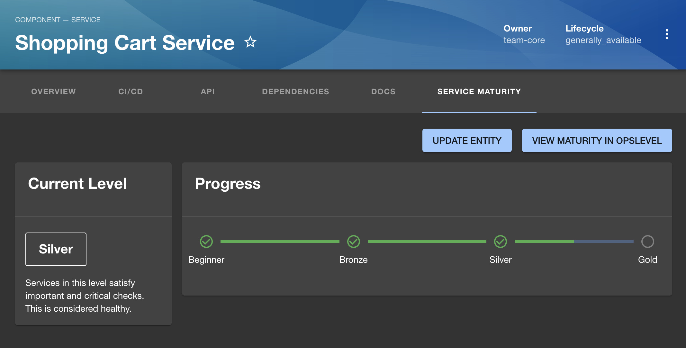

# OpsLevel Maturity Plugin

This plugin helps you leverage OpsLevel's powerful maturity features with your existing Backstage catalog. An OpsLevel API Key is required to use this plugin.




## Install Plugin

```bash
yarn add backstage-plugin-opslevel-maturity
```

Update `app-config.yaml` to add a proxy for OpsLevel. Replace `<your_OpsLevel_API_token>` with a token from https://app.opslevel.com/api_tokens.

```yaml
proxy:
  '/opslevel':
    target: 'https://app.opslevel.com'
    headers:
      X-Custom-Source: backstage
      Authorization: Bearer <your_OpsLevel_API_token>
```

If you're running Self-Hosted OpsLevel, replace `target` with your URL.


## Add Route & Global nav

Update `packages/app/src/App.tsx`

```jsx
import { OpslevelMaturityPage } from 'backstage-plugin-opslevel-maturity';
```
```jsx
    <Route path="/opslevel-maturity" element={<OpslevelMaturityPage />}/>
```


Update `packages/app/src/components/Root/Root.tsx`

```tsx
import CheckCircleOutlineIcon from '@material-ui/icons/CheckCircleOutline';

```
```tsx
        <SidebarItem
          icon={CheckCircleOutlineIcon}
          to="opslevel-maturity"
          text="Maturity"
        />
```


## Add Entity tab for Maturity

Add to the `serviceEntityPage` in `packages/app/src/components/catalog/EntityPage.tsx`

```tsx
import { EntityOpsLevelMaturityContent } from 'backstage-plugin-opslevel-maturity';
```
```tsx
    <EntityLayout.Route path="/maturity" title="Service Maturity">
      <EntityOpsLevelMaturityContent />
    </EntityLayout.Route>
```

## Next Steps

Visit the Maturity tab in Backstage to get started.
