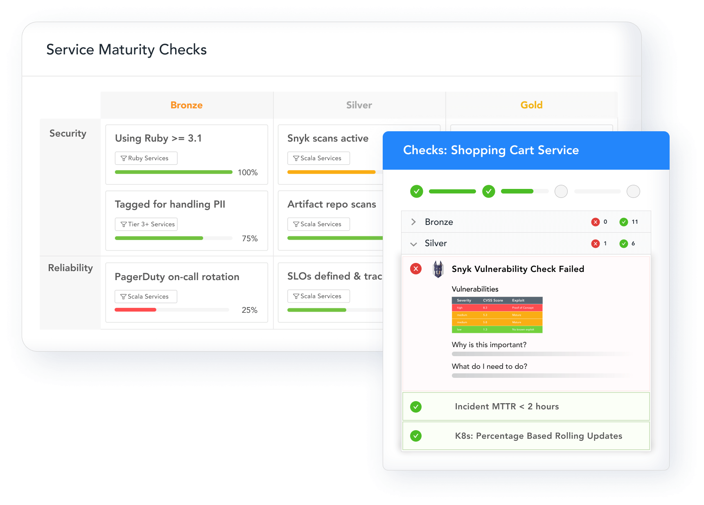
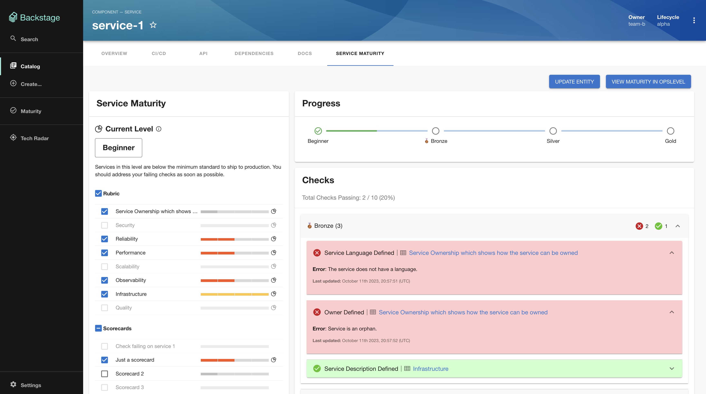
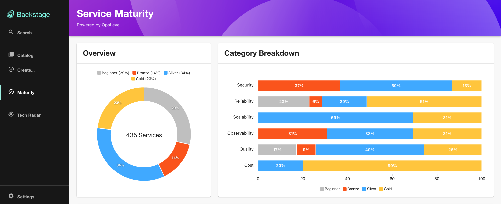

[](https://app.opslevel.com/services/backstage_plugin/maturity-report)
[](https://www.npmjs.com/package/backstage-plugin-opslevel-maturity)

# OpsLevel Maturity Plugin

This plugin helps you leverage OpsLevel's powerful maturity features with your existing Backstage catalog. An OpsLevel API Key is required to use this plugin.







[OpsLevel](https://www.opslevel.com/) gives platform engineers and DevOps leaders the tools to drive service maturity for their teams. We understand that maturity features alongside your software catalog are critical to a culture of service ownership. Which is why we’ve made our maturity features available to Backstage users within their existing service catalog.

OpsLevel uses [Checks](https://www.opslevel.com/docs/getting-started-with-checks) to measure Service Maturity. Checks let you explicitly define how you want your services to be built and operated.
With OpsLevel Checks, you can verify that services:
* Are using a particular version of a library or framework
* Have migrated to a new third-party tool (e.g., all services use Splunk)
* Meet certain operational requirements (e.g., all Tier-1 services have an on-call schedule)

And a whole lot more.

Paired with our [Rubric](https://www.opslevel.com/docs/getting-started-with-rubrics), Checks allow you to get a holistic view of the health of your software ecosystem. This allows you to not just catalog and create new services but also take action to prevent outages and vulnerabilities.

With the plugin, you can view maturity progress in context with the rest of your service information in Backstage. If you want to dig deeper, you can toggle back to OpsLevel from Backstage to see more health metrics through our Rubric or Check Reports.


## Install Plugin

```bash
yarn add --cwd packages/app backstage-plugin-opslevel-maturity
```

Update `app-config.yaml` to add a proxy for OpsLevel. Replace `<your_OpsLevel_API_token>` with a token from https://app.opslevel.com/api_tokens.

```yaml
proxy:
  '/opslevel':
    target: 'https://app.opslevel.com'
    headers:
      X-Custom-Source: backstage
      Authorization: Bearer <your_OpsLevel_API_token>
    allowedHeaders: ['GraphQL-Visibility']
```

If you're running Self-Hosted OpsLevel, replace `target` with your URL.


## Add Route & Global nav

Update `packages/app/src/App.tsx`

```jsx
import { OpslevelMaturityPage } from 'backstage-plugin-opslevel-maturity';
```
```jsx
    <Route path="/opslevel-maturity" element={<OpslevelMaturityPage />}/>
```


Update `packages/app/src/components/Root/Root.tsx`

```tsx
import CheckCircleOutlineIcon from '@material-ui/icons/CheckCircleOutline';

```
```tsx
        <SidebarItem
          icon={CheckCircleOutlineIcon}
          to="opslevel-maturity"
          text="Maturity"
        />
```


## Add Tab for Maturity to Services

In `packages/app/src/components/catalog/EntityPage.tsx` import the plugin and add it to `serviceEntityPage`

```tsx
import { EntityOpsLevelMaturityContent } from 'backstage-plugin-opslevel-maturity';
```
```tsx
    <EntityLayout.Route path="/maturity" title="Service Maturity">
      <EntityOpsLevelMaturityContent />
    </EntityLayout.Route>
```

## Next Steps

Visit the Maturity tab in Backstage to get started.
